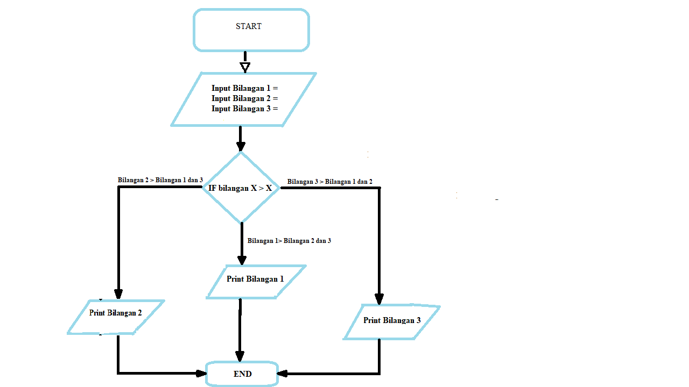
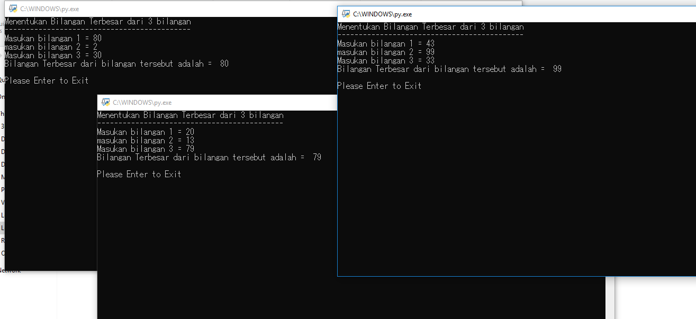

# Program Mencari bilangan terbesar dari 3 buah bilangan <h1>
# Pengenalan <h2>
- Program ini adalah program untuk mencari bilangan terbesar dari 3 buah bilangan yang di inputkan, di bawah ini adalah keterangan flowchart atau alur kerjanya

# Alat yang di butuhkan <h2>
- Python versi 3.6 ke atas
# Flowchart <h2>
#  
# Cara pemakaian program tersebut <h2>
1. User memasukan nilai bilangan pertama, kedua dan ketiga.
2. Program akan memproses bilangan terbesar dari 3 buah bilangan tersebut.
3. jika bilangan pertama lebih besar dari bilangan ke-dua dan ke tiga maka outputnya akan keluar bilangan pertama dan begitu juga seterusnya.
4. Contoh Hasilnya seperti di gambar berikut.
#  
